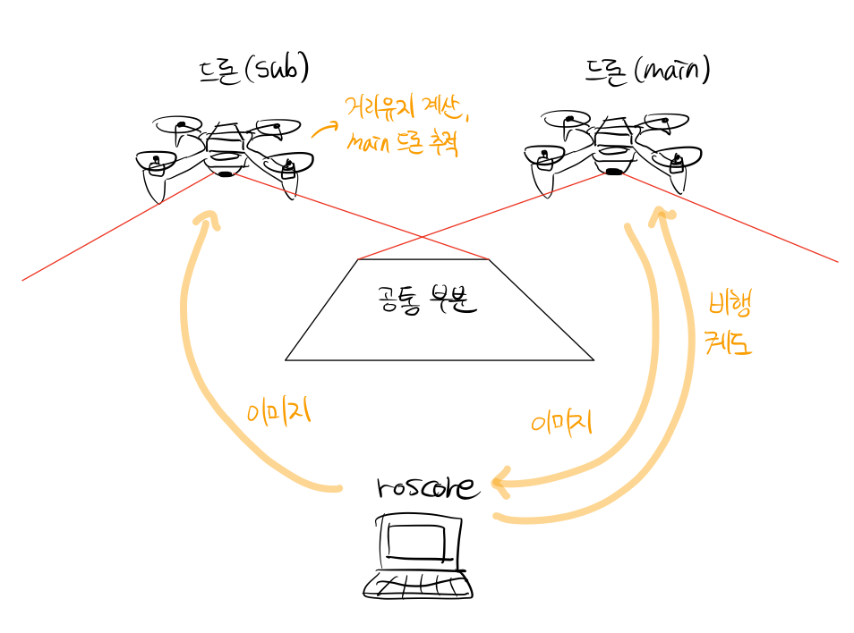

# homography_vision
단안카메라 2대의 상대 위치를 추정하기 위한 패키지 (현재 미완성)

## 1.summary
최종 목표는 드론 2대의 하부에 각각 단안카메라를 설치하고
이를 통해 받아오는 이미지를 feature matching 과 homography 추정을 통해
드론 2대의 상대 position과 orientation을 출력하는 것입니다.

</img>

## 2.how to use
현재 구조는 zed_mini 한 대로 2대의 역할을 하도록 되어있습니다. 
image_in1 : zed_mini의 image_rect_color영상을 사진으로 저장하여 불러옴
image_in2 : zed_mini의 /zedm/zed_node/rgb/image_rect_color 토픽에서 실시간으로 불러옴

### 1. homography_vision/src/main.cpp 를 수정해야합니다.
  #### 1-1. 
  ``` cpp
    image_in1 = imread("home/kwon/catkin_ws/image/image.png",IMREAD_COLOR);
  ```
